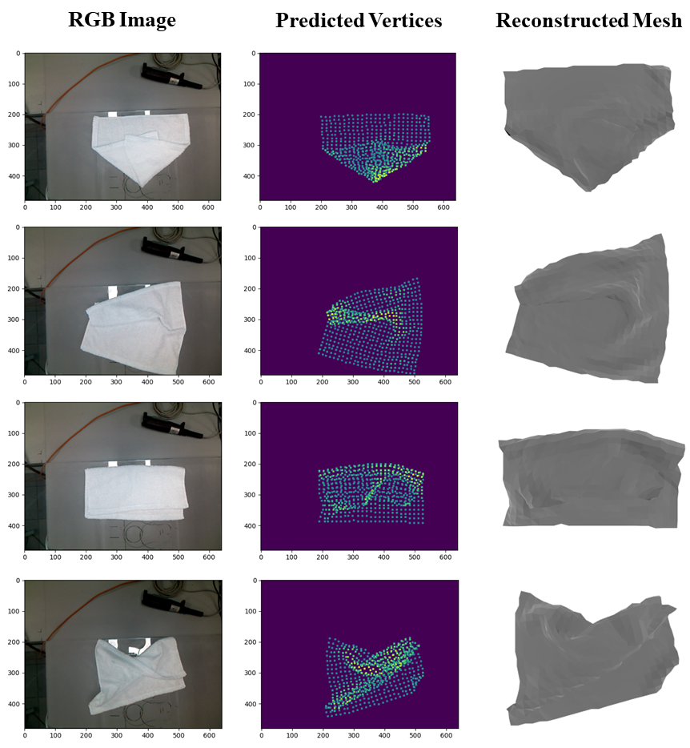

Hello! My name is Wanze Li. I am a 4th year PhD student at the [National University of Singapore](https://cde.nus.edu.sg/me/), and I am fortunate to be advised by Prof. [Gregory Chirikjian](https://chirikjianlab.github.io/). Prior to starting as a Ph.D. student, I earned my MSE degree in the mechanical engineering department of [Johns Hopkins University](https://me.jhu.edu/), where I worked closely with Prof. [Russell Taylor](https://www.cs.jhu.edu/faculty/russell-taylor/) and Prof. [Iulian Iordachita](https://amiro.lcsr.jhu.edu/). My research interests predominantly lie in robot manipulation and I am particularly interested in solving robotic tasks with generative models like diffusion models. 

News
======
-[Jan 2025] Our paper about [deformable object state estimation](https://arxiv.org/abs/2409.11831) is accepted by ICRA 2025.   
-[Jan 2025] I am glad to share that I passed my PhD defense and finished my PhD journey.  
-[Dec 2024] I made the oral presentation to share our work about picking objects by [hooking and hanging](https://arxiv.org/abs/2408.06734) in ISRR 2024.   
-[Oct 2024] I made the oral presentation to share our work about [hanging arbitrary objects](https://ieeexplore.ieee.org/abstract/document/10443033) in IROS 2024.   
-[Apr 2024] Our paper about objects hanging is accepted by IEEE Robotics and Automation Letters (RAL).  

Publications (First/Co-first authorship)
======
<!-- 

<table rules="none">
<tr>
<td>

</td>
<td>

 <b>RaggeDi: Diffusion-based State Estimation of Disordered Rags, Sheets, Towels and Blankets</b>  
       Jikai Ye*, <b>Wanze Li*</b>, Shiraz Khan, Gregory S. Chirikjian  
       * means euqally contributed  
       IEEE International Conference on Robotics and Automation (*ICRA*) 2025   
       <a href="https://wanzeli.github.io/RaggeDi/">[project page]</a>   <a href="https://arxiv.org/abs/2409.11831">[paper]</a>

</td>
</tr>
</table>    

 -->

  
  
 <b>RaggeDi: Diffusion-based State Estimation of Disordered Rags, Sheets, Towels and Blankets</b>  
       Jikai Ye*, <b>Wanze Li*</b>, Shiraz Khan, Gregory S. Chirikjian  
       * means euqally contributed  
       IEEE International Conference on Robotics and Automation (*ICRA*) 2025   
       <a href="https://wanzeli.github.io/RaggeDi/">[project page]</a>   <a href="https://arxiv.org/abs/2409.11831">[paper]</a>

