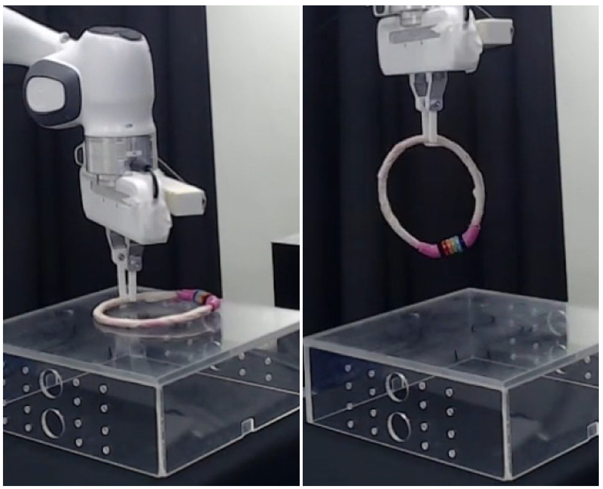
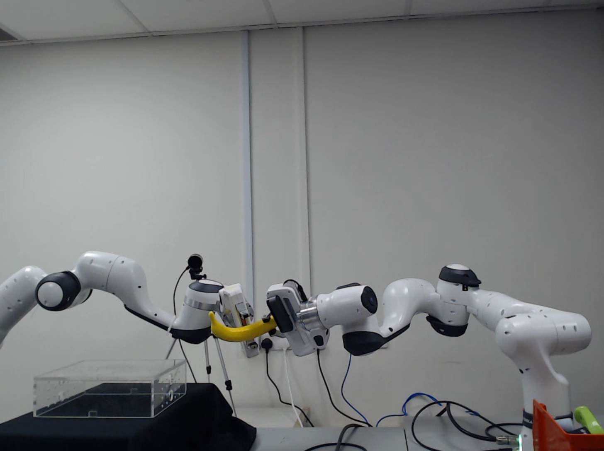
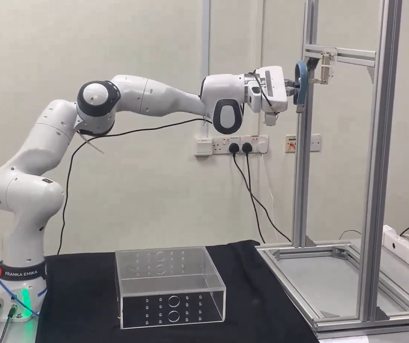
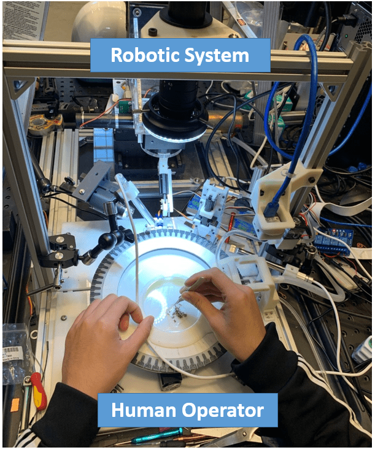
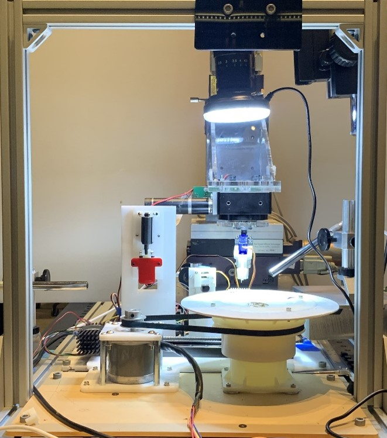

Hello! My name is Wanze Li. I am a 4th year PhD student at the [National University of Singapore](https://cde.nus.edu.sg/me/), and I am fortunate to be advised by Prof. [Gregory Chirikjian](https://chirikjianlab.github.io/). Prior to starting as a Ph.D. student, I earned my MSE degree in the mechanical engineering department of the [Johns Hopkins University](https://me.jhu.edu/), where I worked closely with Prof. [Russell Taylor](https://www.cs.jhu.edu/faculty/russell-taylor/) and Prof. [Iulian Iordachita](https://amiro.lcsr.jhu.edu/). My research interests predominantly lie in robot manipulation and I am particularly interested in solving robotic tasks with generative models like diffusion models. 

My CV is available in: [Wanze Li's Curriculum Vitae](../assets/LiWanze_CV_v5.pdf)

[Email](li_wanze@u.nus.edu)/[Google Scholar](https://scholar.google.com/citations?user=HF3-0ncAAAAJ&hl=en)/[GitHub](https://github.com/wanzeli)/[LinkedIn](https://www.linkedin.com/in/wanze-li-11854119a/)

News
======
-[Jan 2025] Our paper about [deformable object state estimation](https://arxiv.org/abs/2409.11831) is accepted by ICRA 2025.   
-[Jan 2025] I am glad to share that I passed my PhD defense and finished my PhD journey.  
-[Dec 2024] I made the oral presentation to share our work about picking objects by [hooking and hanging](https://arxiv.org/abs/2408.06734) in ISRR 2024.   
-[Oct 2024] I made the oral presentation to share our work about [hanging arbitrary objects](https://ieeexplore.ieee.org/abstract/document/10443033) in IROS 2024.   
-[Apr 2024] Our paper about objects hanging is accepted by IEEE Robotics and Automation Letters (RAL).  

Publications (First/Co-first authorship)
======

  
  
 <b>RaggeDi: Diffusion-based State Estimation of Disordered Rags, Sheets, Towels and Blankets</b>  
       Jikai Ye*, <b>Wanze Li*</b>, Shiraz Khan, Gregory S. Chirikjian  
       * means equally contributed  
       IEEE International Conference on Robotics and Automation (<em>ICRA</em>) 2025   
       <a href="https://wanzeli.github.io/RaggeDi/">[project page]</a>   <a href="https://arxiv.org/abs/2409.11831">[paper]</a>

  
  
 <b>Grasping by Hanging: a Learning-Free Grasping Detection Method for Previously Unseen Objects</b>  
       <b>Wanze Li</b>, Wan Su, Gregory S. Chirikjian  
       International Symposium of Robotics Research (<em>ISRR</em>) 2024   
       <a href="../assets/ISRR24_0012_VD_i.mp4">[video]</a>   <a href="https://arxiv.org/abs/2408.06734">[paper]</a>

  
  
 <b>Autonomous Learning-Free Grasping and Robot-to-Robot Handover of Unknown Objects</b>  
       Yuwei Wu* <b>Wanze Li*</b>, Zhiyang Liu, Weixiao Liu, Gregory S. Chirikjian  
       * means equally contributed  
       Under Review by Autonomous Robots, 2024   
       <a href="../assets/handover.mp4">[Demo]</a>  

  
  
 <b>I Get the Hang of It! A Learning-Free Method to Predict Hanging Poses for Previously Unseen Objects</b>  
       <b>Wanze Li</b>, Lexin Pan, Boren Jiang, Yuwei Wu, Weixiao Liu, Gregory S. Chirikjian  
       IEEE Robotics and Automation Letters (<em>RA-L</em>), 2024   
       <a href="https://chirikjianlab.github.io/Igethangofit/">[project page]</a>   <a href="https://ieeexplore.ieee.org/abstract/document/10443033">[paper]</a>

  
  
 <b> Progress in development of an automated mosquito salivary gland extractor: A step forward to malaria vaccine mass production </b>  
       <b>Wanze Li</b>, Zhuoqun Zhang, Zhuohong He, Parth Vora, Alan Lai, Balazs Vagvolgyi, Simon Leonard, Anna Goodridge, Iulian Iordachita, Sumana Chakravarty, Kim Lee Sim, Stephen L Hoffman, Russell H Taylor  
       IEEE International Conference on Automation Science and Engineering (<em>CASE</em>) 2021   
       <a href="../assets/mosquito_video_2.mp4">[video]</a>   <a href="https://ieeexplore.ieee.org/abstract/document/9551500">[paper]</a>

  
  
 <b>Automated mosquito salivary gland extractor for pfspz-based malaria vaccine production </b>  
       <b>Wanze Li</b>, Zhuohong He, Parth Vora, Yanzhou Wang, Balazs Vagvolgyi, Simon Leonard, Anna Goodridge, Iulian Iordachita, Stephen L Hoffman, Sumana Chakravarty, Russell H Taylor  
       IEEE International Conference on Robotics and Automation (<em>ICRA</em>) 2021   
       <a href="../assets/mosquito_video_1.mp4">[video]</a>   <a href="https://ieeexplore.ieee.org/abstract/document/9560959">[paper]</a>

